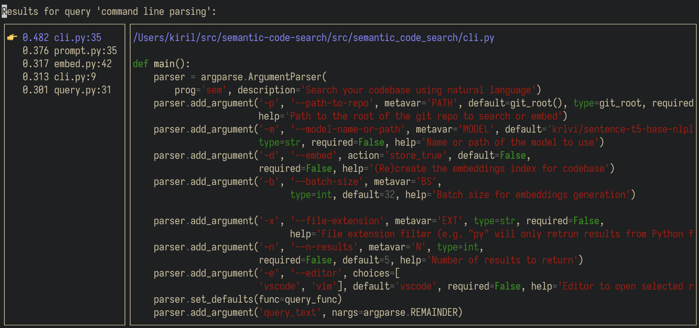

# Semantic Code Search

<p align="center">
  
</p>
<p align='center'>
  Search your codebase with natural language. No data leaves your computer.
</p>
<p align='center'>
    <a href="https://github.com/sturdy-dev/semantic-code-search/blob/main/LICENSE.txt">
        
    </a>
    <a href="https://pypi.org/project/semantic-code-search">
     
    </a>
</p>
<p align="center">
  <a href="#overview">🔍 Overview</a> •
  <a href="#installation">🔧 Installation</a> •
  <a href="#usage">💻 Usage</a> •
  <a href="#command-line-flags">📖 Docs</a> •
  <a href="#how-it-works">🧠 How it works</a>
</p>

--------------------------------------------------------------------

## Overview

`sem` is a command line application which allows you to search your git repository using natural language. For example you can query for:

- 'Where are API requests authenticated?'
- 'Saving user objects to the database'
- 'Handling of webhook events'
- 'Where are jobs read from the queue?'

You will get a (visualized) list of code snippets and their `file:line` locations. You can use `sem` for exploring large codebases or, if you are as forgetfull as I am, even small ones.

Basic usage:

```bash
sem 'my query'
```

This will present you with a list of code snippets that most closely match your search. You can select one and press  `Return` to open it in your editor of choice.

How does this work? In a nutshell, it uses a neural network to generate code embeddings. More info [below](#how-it-works).

> NB: All processing is done on your hardware and no data is transmitted to the Internet.

## Installation

You can install `semantic-code-search` via `pip`.

### Pip (MacOS, Linux, Windows)

```bash
pip3 install semantic-code-search
```

## Usage

TL;DR:

```bash
cd /my/repo
sem 'my query'
```

Run `sem --help` to see [all available options](#command-line-flags).

### Searching for code

Inside your repo simply run

```bash
sem 'my query'
```

*(quotes can be omitted)*

> Note that you *need to* be  inside a git repository or provide a path to a repo with the `-p` argument.

Before you get your *first* search results, two things need to happen:

- The app downloads its [model](#model) (~500 MB). This is done only once for the installation.
- The app generates 'embeddings' of your code. This will be cached in an `.embeddings` file at the root of the repo and is reused in subsequent searches.

Depending on the project size, the above can take from a couple of seconds to minutes. Once this is complete, querying is very fast.

Example output:

```bash session
foo@bar:~$ cd /my/repo
foo@bar:~$ sem 'parsing command line args'
Embeddings not found in /Users/kiril/src/semantic-code-search. Generating embeddings now.
Embedding 15 functions in 1 batches. This is done once and cached in .embeddings
Batches: 100%|█████████████████████████████████████████████████████████| 1/1 [00:07<00:00,  7.05s/it]
```

### Navigating search results

By default, a list of the top 5 matches are shown, containing :

- Similarity score
- File path
- Line number
- Code snippet

You can navigate the list using the `↑` `↓` arrow keys or `vim` bindings. Pressing `return` will open the relevant file at the line of the code snippet in your editor.

> NB: The editor used for opening can be set with the `--editor` argument.

Example results:



### Command line flags

``` bash
usage: sem [-h] [-p PATH] [-m MODEL] [-d] [-b BS] [-x EXT] [-n N]
           [-e {vscode,vim}]
           ...

Search your codebase using natural language

positional arguments:
  query_text

optional arguments:
  -h, --help            show this help message and exit
  -p PATH, --path-to-repo PATH
                        Path to the root of the git repo to search or embed
  -m MODEL, --model-name-or-path MODEL
                        Name or path of the model to use
  -d, --embed           (Re)create the embeddings index for codebase
  -b BS, --batch-size BS
                        Batch size for embeddings generation
  -x EXT, --file-extension EXT
                        File extension filter (e.g. "py" will only return
                        results from Python files)
  -n N, --n-results N   Number of results to return
  -e {vscode,vim}, --editor {vscode,vim}
                        Editor to open selected result in
```

## How it works

In a nutshell, this application uses a [transformer](https://en.wikipedia.org/wiki/Transformer_(machine_learning_model)) machine learning model to generate embeddings of methods and functions in your codebase. Embeddings are information dense numerical representations of the semantics of the text/code they represent.

Here is a great blog post by Jay Alammar which explains the concept really nicely:
> <https://jalammar.github.io/illustrated-word2vec/>

When the app is ran with the `--embed` argument, function and method definitions are first extracted from the source files and then used for sentence embedding. To avoid doing this for every query, the results are compressed and saved in an `.embeddings` file.

When a query is being processed, embeddings are generated from the query text. This is then used in a 'nearest neighbor' search to discover function or methods with similar embeddings. We are basically comparing the [cosine similarity](https://en.wikipedia.org/wiki/Cosine_similarity) between vectors.

### Model

The application uses [sentence transformer](https://www.sbert.net/) model architecture to produce 'sentence' embeddings for functions and queries. The particular model is [krlvi/sentence-t5-base-nlpl-code_search_net](https://huggingface.co/krlvi/sentence-t5-base-nlpl-code_search_net) which is based of a [SentenceT5-Base](https://github.com/google-research/t5x_retrieval#released-model-checkpoints) checkpoint with 110M parameters and a pooling layer.

It has been further trained on the [code_search_net](https://huggingface.co/datasets/code_search_net) dataset of 'natural language' — 'programming language' pairs with a [MultipleNegativesRanking](https://github.com/UKPLab/sentence-transformers/blob/master/sentence_transformers/losses/MultipleNegativesRankingLoss.py) loss function.

You can experiment with your own sentence transformer models with the `--model` parameter.

## Bugs and limitations

- Currently, the `.embeddings` index is not updated when repository files change. As a temporary workaround, `sem embed` can be re-ran occasionally.
- Supported languages: `{ 'python', 'javascript', 'typescript', 'ruby', 'go', 'rust', 'java', 'c', 'c++' }`
- Supported text editors for opening results in: `{ 'vscode', 'vim' }`

## License

Semantic Code Search is distributed under [AGPL-3.0-only](LICENSE.txt). For Apache-2.0 exceptions — <kiril@codeball.ai>
